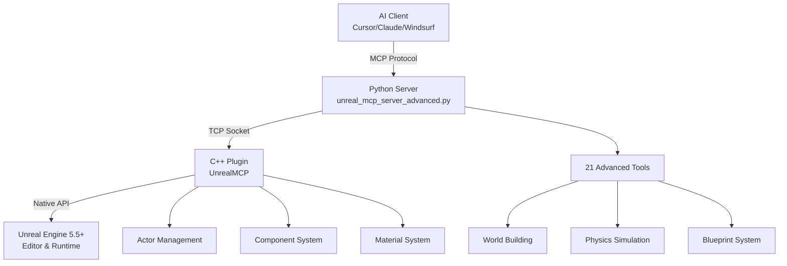

# 🚀 The Most Advanced MCP Server for Unreal Engine

[](https://www.unrealengine.com/)
[](https://youtube.com/@flopperam)
[](https://discord.gg/3KNkke3rnH)
[](https://twitter.com/Flopperam)
[](https://tiktok.com/@flopperam)

**Control Unreal Engine 5.5+ through natural language using the Model Context Protocol (MCP). Build complex 3D worlds, physics simulations, and architectural structures with AI-powered commands.**

> **Active Development**: This project is under very active development with consistent updates, new features, and improvements being added regularly. Join our [Discord](https://discord.gg/3KNkke3rnH) to stay updated on the latest releases!

<!-- ---

## 🎯 Why This Is The Most Advanced MCP Server

Unlike basic MCP implementations, this server provides **real-time bidirectional control** over a complete 3D engine with:

- **🏗️ Advanced World Building**: Create entire towns, realistic houses, complex mazes, and architectural structures
- **⚙️ Real-Time Physics**: Spawn physics-enabled objects with custom materials, collision, and dynamics  
- **🎨 Visual Programming**: Generate and compile Blueprint classes with custom components and logic
- **🌍 Full Scene Control**: Manage actors, transforms, lighting, and camera systems programmatically
- **🚀 High Performance**: Native C++ plugin with TCP communication for minimal latency

**21 powerful tools** that can build anything from simple cubes to complete cityscapes.

--- -->

## 🎬 See It In Action

Check out these examples of the MCP server in action on our channel:

- **[Advanced Metropolis Generation](https://youtube.com/shorts/6WkxCQXbCWk)** - Watch AI generate a full-blown metropolis with towers, streets, parks, and over 4,000 objects from a single prompt
- **[Advanced Maze & Mansion Generation](https://youtube.com/shorts/ArExYGpIZwI)** - Watch Claude generate a playable maze and complete mansion complex with wings, towers, and arches
- **[Architectural Structures](https://youtube.com/shorts/i6CYbvPTvPs)** - Building detailed structures with AI

## ⭐ Featured Capabilities

### Procedural Architecture
```bash
# Create an entire realistic town with roads, buildings, and infrastructure
> "Build a medium-sized town with mixed architectural styles"
→ create_town(town_size="medium", architectural_style="mixed", building_density=0.8)
```

### Advanced Structures  
```bash
# Build complex multi-room houses with windows, doors, and roofs
> "Create a Victorian mansion with 3 floors and a chimney"
→ construct_house(house_style="mansion", width=1500, height=900)
```

### Intelligent Mazes
```bash
# Generate solvable mazes with guaranteed paths using recursive backtracking
> "Make a 15x15 maze with high walls"
→ create_maze(rows=15, cols=15, wall_height=4, cell_size=250)
```

### Physics Simulations
```bash
# Create physics objects with custom properties
> "Spawn a heavy bouncing ball that falls from above"  
→ create_bouncy_ball(name="HeavyBall", location=[0, 0, 500])
```

---

## 🛠️ Complete Tool Arsenal

| **Category** | **Tools** | **Description** |
|--------------|-----------|-----------------|
| **World Building** | `create_town`, `construct_house`, `create_tower`, `create_arch` | Build complex architectural structures and entire settlements |
| **Level Design** | `create_maze`, `create_obstacle_course`, `create_pyramid`, `create_wall` | Design challenging game levels and puzzles |
| **Physics & Materials** | `spawn_physics_actor`, `create_bouncy_ball`, `set_physics_properties` | Create realistic physics simulations |
| **Blueprint System** | `create_blueprint`, `compile_blueprint`, `add_component_to_blueprint` | Visual scripting and custom actor creation |
| **Actor Management** | `spawn_actor`, `delete_actor`, `set_actor_transform`, `find_actors_by_name` | Precise control over scene objects |
---

## ⚡ Lightning-Fast Setup

### Prerequisites
- **Unreal Engine 5.5+** 
- **Python 3.12+**
- **MCP Client** (Claude Desktop, Cursor, or Windsurf)

### 1. Setup the Plugin

**Add to Your Unreal Engine Project**
```bash
# Copy the plugin to your project
cp -r UnrealMCP/ YourProject/Plugins/

# Enable in Unreal Editor
Edit → Plugins → Search "UnrealMCP" → Enable → Restart Editor
```

**Alternative: Install for All Projects**
```bash
# Copy to Engine plugins folder (available to all projects)
cp -r UnrealMCP/ "C:/Program Files/Epic Games/UE_5.5/Engine/Plugins/"

# Enable in any project through the Plugin Browser
Edit → Plugins → Search "UnrealMCP" → Enable
```

### 2. Launch the MCP Server

```bash
cd Python
uv run unreal_mcp_server_advanced.py
```

### 3. Configure Your AI Client

Add this to your MCP configuration:

**Cursor**: `.cursor/mcp.json`
**Claude Desktop**: `~/.config/claude-desktop/mcp.json` 
**Windsurf**: `~/.config/windsurf/mcp.json`

```json
{
  "mcpServers": {
    "unrealMCP": {
      "command": "uv",
      "args": [
        "--directory", 
        "/path/to/unreal-engine-mcp/Python",
        "run", 
        "unreal_mcp_server_advanced.py"
      ]
    }
  }
}
```

### 🎉 4. Start Building!

```bash
> "Create a medieval castle with towers and walls"
> "Build a physics playground with bouncing balls"  
> "Generate a town square with fountain and buildings"
> "Make a challenging maze for players to solve"
```

---

## 🏗️ Architecture



**🔥 Performance**: Native C++ plugin ensures minimal latency for real-time control
**🛡️ Reliability**: Robust TCP communication with automatic reconnection
**🎨 Flexibility**: Full access to Unreal's actor, component, and Blueprint systems

---

## Examples & Guides

### Quick Examples
```bash
# Build a complete scene
> "Create a small town with a central plaza, some houses, and a tower"

# Physics demonstration  
> "Make a pyramid of boxes that can be knocked down by a bouncing ball"

# Architectural showcase
> "Build a modern house with glass windows and a flat roof next to a traditional cottage"

# Game level design
> "Create an obstacle course with pillars, walls, and a finish line"
```

### Advanced Workflows
- **Multi-AI Building**: Set up multiple AI agents to build different districts of a city simultaneously
- **Physics Playgrounds**: Create interactive environments with realistic object behavior
- **Procedural Content**: Generate mazes, buildings, and landscapes through AI prompts
- **Rapid Prototyping**: Test game mechanics and level designs through natural language

---

## 🌟 What Makes This Special


**AI-First Design**: Every tool designed specifically for natural language control by AI agents

**Real-Time Feedback**: Immediate visual results in Unreal Editor as you build

**Scalable**: From single objects to complete environments - no limits on complexity

**Game-Engine Native**: Full access to Unreal's rendering, physics, and material systems

**Extensible**: Add your own tools and extend functionality through the modular architecture

---

## 💬 Community & Support

**Join our community and get help building amazing worlds!**

### 🌐 Connect With Us
- **📺 YouTube**: [youtube.com/@flopperam](https://youtube.com/@flopperam) - Tutorials, showcases, and development updates
- **💬 Discord**: [discord.gg/8yr1RBv](https://discord.gg/3KNkke3rnH) - Get help, share creations, and discuss the plugin
- **🐦 Twitter/X**: [twitter.com/Flopperam](https://twitter.com/Flopperam) - Latest news and quick updates  
- **📱 TikTok**: [tiktok.com/@flopperam](https://tiktok.com/@flopperam) - Quick tips and amazing builds

### Get Help & Share
- **Questions?** Ask in our Discord server for real-time support
- **Bug reports?** Open an issue on GitHub with reproduction steps
- **Feature ideas?** Join the discussion in our community channels

---

## License
MIT License - Build amazing things freely.
